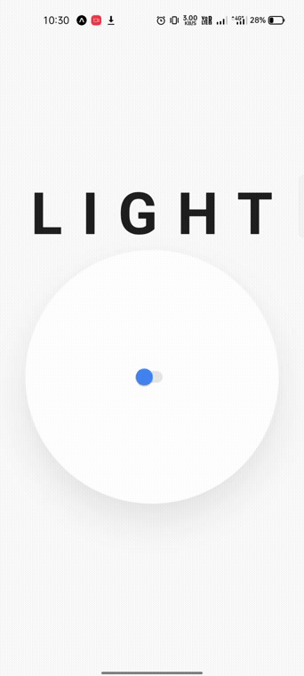

# React Native Reanimated V2

### This repository will help you to learn about React Native Reanimated V2. You can checkout some of the examples.
### In Videos folder you can download these videos.
### If you wanna try just clone it and in project directory run the command  ```npm i```
### After this you have to install Expo Go in your Android Device/Emulator to run the app.
### You can try all these animations and you can check the code for all animation in Components 

<hr/>

<p style='display:flex;flex-direction:row; flex-wrap:wrap; justify-content:center;'>





</p>
